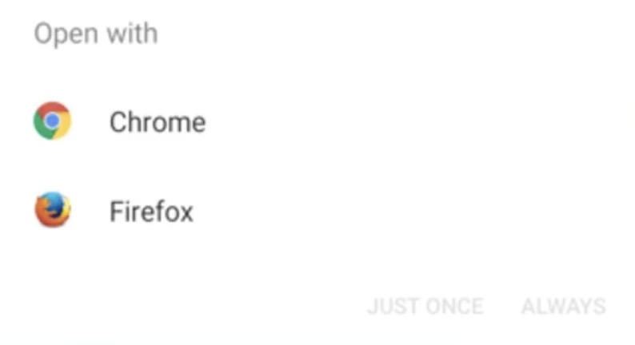

# Introduction to Android Security

> **Android is based on the Linux Operating System!**

→ Meaning your anroid can take commands just like any Linux device. Ex: ls, cd, rm, etc,. <br>
→ Permissions to folders and applications are dependent on the Linux
Operating System file permission model (_ xxx xxx xxx)

```shell
# ls -l file
  - rw- r-- r--@ 1 root root 0 Nov 19 23:49 file
  |  |   |   |
  |  |   |   |                  |
  |  |   | Other (r--)          |             
  |  |   |                      |         
  |  | Group (r--)              |               r  =  Readable
  |  |                          |               w  =  Writeable
  |  |                          |               x  =  Executable
  | Owenr (rw-)                 |               -  =  Denied
  |                             |             
  |                             |                
  |                             |
 File type 
```

## <span style="color:#92A8D1">Dalvik</span> vs the <span style="color:#88B04B">Android Runtime</span>

<div align="center"> <iframe src="https://giphy.com/embed/TYgQAdsygGRfHaiCKY" width="480" height="400" frameBorder="0" class="giphy-embed" allowFullScreen></iframe></div>

### <span style="color:#92A8D1">Dalvik</span>
Every application on Android phone or an Android emulator is run in a virtual machine known as the Android Runtime

- Dalvik was the original runtime VM, and is still referenced to by the name Dalvik bytecode
    - Dalvik is not utilised in **modern Android OS**, and has been replaced by the ART. *(In some cases it is still refered to as Dalvik Byte-code.)*

### <span style="color:#88B04B">Android Runtime</span>

- This is the modern translation layer from the application's bytecode to device instructions
- Every app runs in its own sandboxed virtual machine
- Likewise, in the file system applications are isolated by creating a new user unique for that application

## Android Identity and Access Management
As mentioned, each application has its own user for the application.

This user is the owner of the application directory (UID between 10000 and 999999, username similar: i.e. u0_a188 for UID 10188) 
- /data/app/com.example1.app - **generic application data**
- /data/data/com.example.app - **runtime storage of data**
- /mnt/sdcard/Android/data/com.example2.app - **externally stored location for runtime**
- /data/data/com.example2.app - **a different app requiring different user**

Let's take the above use case scenario in an Android OS, here there are two different application **example1** and **example2**

Both have entirely separate directories i.e `/data/app/com.example1.app` and `/data/data/com.example2.app` -> This is a totally separate directory owned by a different user with a different UID, *(both the apps are installed on the same phone).*  

So because every single application is assigned to its own directory with its own user account, that's the owner of its directory, **this stops applications from interacting with each other unless explicitly granted permissions, or a Content Provider/Broadcast Receiver is exposed.**
<br>

#### How a developer usually will **grant permissions** to an application to share some data is either through a Content Provider or a Broadcast Receiver?

  For this question let's an everyday use case from user's perspective, when you click on a link or an url to open, there will be a small pop up window that opens in your mobile asking for which application the url or the content to be opened, mostly an URL

1. **Broadcast Receiver**
  
<p align="left">

</p>
What you are seeing above is when we will be using a broadcast receiver to receive some data, such above applications(Web Browsers in our case) would be exposing a broadcast receiver and waiting for the application data to come across through them.

2. **Content Provider**<br>
   <br>
   This is similar to the broadcast receiver but instead of waiting for a response, our application is being served some kind of data out to other applications, if that content provider is exported. 

### Root Users, System Level accounts 
> Root users and system level a/c' are the only way that we are gonna be able to get access to all of the directories

**<span style="color:#88B04B">Emulators with non-Google Play APIs allow <span style="color:#DD4124">$ root</span>**

---

* **Profiles** → This can not allow you to separate not only application data but is can also allow you to separate functions such as the clipboard, contacts, camera etc,. into their own separate profiles.

A real life use case explanation for this would be when you have a phone with a personal and also a work profile on it and you want to isolate those two things from each other, while the profiles still have access to system level functions such as Wifi, Bluetooth 4G LTE, etc,.

  * Separated App Data, useful for things like BYOD (**B**ring **Y**our **O**wn **D**evice)
    * Work Profile, Personal Profile, Always-On VPN for certain apps
    * Still has access to system level functions such as Wifi, Bluetooth, 4G LTE, but can have isolated aspects for Data Loss Prevention like a clipboard (copy-paste), contacts, camera, etc.

* **Primary User** - this is the user created first time the phone is started, always running, can only be removed by factory reset
  
* **Secondary User** - Additional users you can add to the device, and can be created/deleted by the primary user
  
* **Guest User** - can only be one guest user at a time, a fast way to have guest access to the phone
  
* **Kid Mode** - Google Kids Spaces (tablets only), Profiles/Account for Kids, usually vendor specific Samsung Kid Mode
